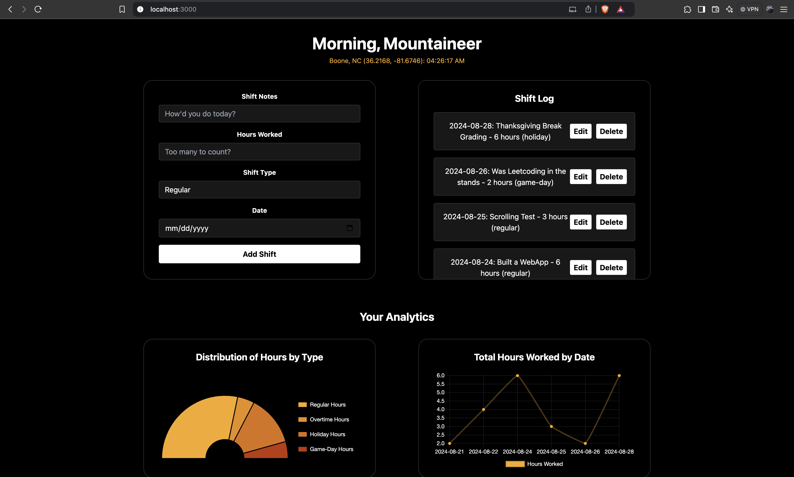

# WorkWell: Freelance and On-Campus Shift Tracker


**Track your time, conquer your goals.**

## Overview

**WorkWell** is a web application tailored for self-employed freelance students and on-campus employees who need an efficient way to log and track their work hours. Whether you're juggling multiple freelance projects or managing shifts as an on-campus employee, WorkWell offers a streamlined solution to keep track of your time, analyze your work patterns, and optimize your productivity.

## Tech Stack

- **Frontend**:

  - **React.js**: Core library for building a dynamic and interactive user interface.
  - **Tailwind CSS**: Utility-first CSS framework for a modern and responsive design.
  - **Chart.js**: Library for rendering intuitive and interactive charts to visualize work patterns.
  - **Google Fonts (Orbitron)**: Custom font for a sleek, futuristic look.

- **Backend**:
  - **Node.js**: JavaScript runtime for building scalable server-side applications.
  - **Express.js**: Web framework for creating RESTful APIs and managing server-side logic.
  - **SQLite**: Lightweight relational database for efficient data storage and retrieval.

## Installation and Setup

1. **Clone the repository**:
   ```bash
   git clone https://github.com/your-username/workwell.git
   ```
2. **Navigate to the project directory**:

   ```bash
   cd workwell
   ```

3. **Install the dependencies**:

   ```bash
   npm install
   ```

4. **Start the backend server**:

   ```bash
   cd server
   node index.js
   ```

5. **Start the frontend client**:

   ```bash
   cd client
   npm start
   ```

6. **Access the application**: Open your browser and go to `http://localhost:3000`.
